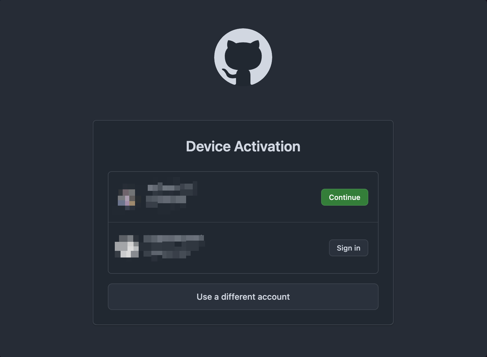
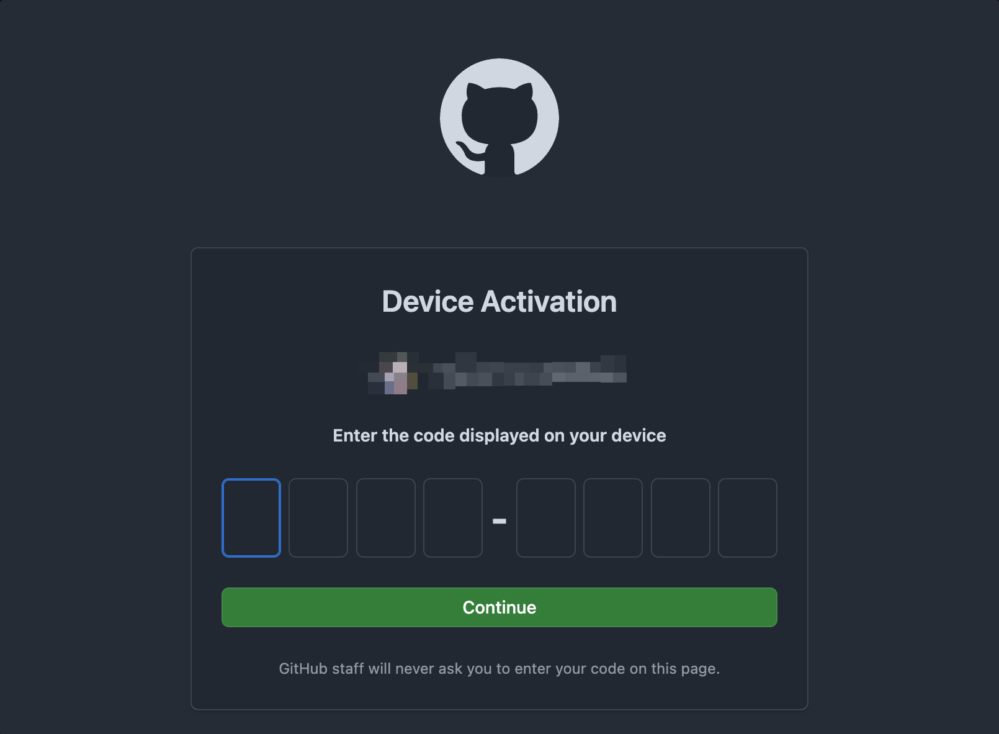
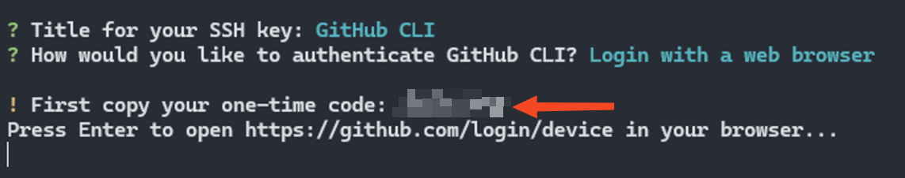
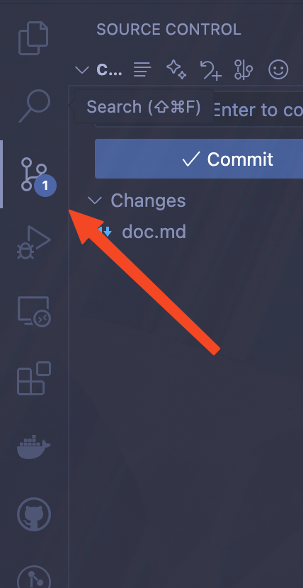
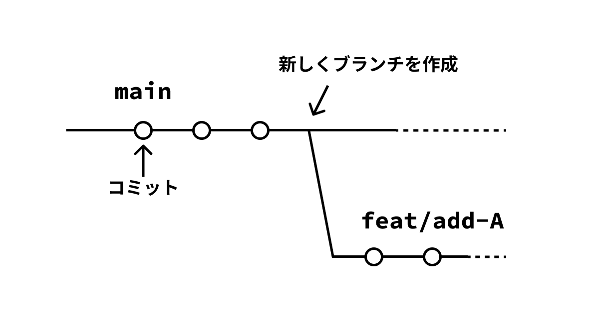
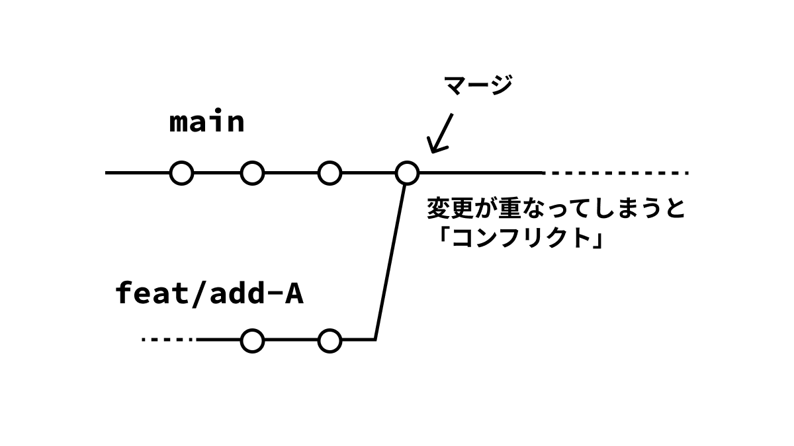

## 0. 環境構築

ここでは、team411 で Git/GitHub を使用していくために必要な環境構築をしていきます。
もうすでに、環境ができている人は軽く読み飛ばしてください。

### 0.1. GitHub アカウントの作成

[GitHub](https://github.com/)にアクセスし、「Sign Up」からアカウントを作成してください。
すでに GitHub アカウントを持っている人はそのアカウントを使用してください。

ここで登録時に使用したメールアドレスを覚えておいてください。
team411 の組織やリポジトリに招待されたときは、登録したメールアドレスに連絡が来ます。
普段よく使うメールアドレスが良いでしょう。

### 0.2. Git のインストール

まず、今回の研修で使用するメインのアプリケーションである、`git`をインストールします。
それぞれ自分が使っている OS の方法を参考にインストールしてください。

#### Windows の場合

`Win + R`キーを押下し、`powershell`と入力して`Enter`（Power Shell が開きます）。
以下のコマンドを入力し実行。

```powershell
winget install Git.Git
```

「このアプリがデバイスに変更を加えることを許可しますか？」と聞かれるので「はい」を選択。
実行が終わったらインストールは完了です。

#### MacOS の場合

「ターミナル」アプリを起動します。
まず、以下のコマンドを入力し実行して`brew`をインストールします。

```zsh
/bin/bash -c "$(curl -fsSL https://raw.githubusercontent.com/Homebrew/install/HEAD/install.sh)"
```

少し時間がかかると思いますが、待ちます。
実行が終わったら次に`brew`を使って`git`をインストールします。

以下のコマンドを入力し、実行してください。

```zsh
brew install git
```

実行が終わったらインストールは完了です。

#### Linux (Debian 系)の場合

ターミナルのアプリケーションを開き以下のコマンドを実行してください。

```zsh
sudo apt update
sudo apt install git
```

実行が終わったらインストールは完了です。

### 0.3. GitHub Cli のインストール

次に、先ほど作成した GitHub アカウントとの連携を簡単に行うためのアプリケーション`GitHub CLI`をインストールします。
これも同様に、それぞれ自分が使っている OS の方法を参考にインストールしてください。

#### Windows の場合

`Win + R`キーを押下し、`powershell`と入力して`Enter`（Power Shell が開きます）。
以下のコマンドを入力し実行。

```powershell
winget install GitHub.cli
```

「このアプリがデバイスに変更を加えることを許可しますか？」と聞かれるので「はい」を選択。
実行が終わったらインストールは完了です。

#### MacOS の場合

「ターミナル」アプリを起動します。
以下のコマンドを入力し、実行してください。

```zsh
brew install gh
```

実行が終わったらインストールは完了です。

#### Linux (Debian 系)の場合

ターミナルのアプリケーションを開き以下のコマンドを実行してください。

```zsh
sudo apt update
sudo apt install gh
```

実行が終わったらインストールは完了です。

### 0.4. ローカルの Git を自分の GitHub アカウントと連携

ターミナルアプリケーションを開き、以下のコマンドを実行して、先ほど作成した GitHub アカウントとの連携を行います。

```zsh
gh auth login
```

すると次のように表示されるので、そのまま`Enter`を押します。
（ログインに使うアカウントの種類を聞かれています。今回は GitHub を使用するのでそのままそれを選択します）

```zsh
? Where do you use GitHub?  [Use arrows to move, type to filter]
> GitHub.com
  Other
```

次に、認証の方法を聞かれるので、下矢印キーを押して「ssh」を選択し`Enter`を押します。

```zsh
? What is your preferred protocol for Git operations on this host?  [Use arrows to move, type to filter]
  HTTPS
> SSH
```

続けて、いくつか質問をされますので、そのまま`Enter`を押します。

```zsh
? Generate a new SSH key to add to your GitHub account? (Y/n)
? Enter a passphrase for your new SSH key (Optional):                            ? Title for your SSH key: (GitHub CLI)
```

次のように聞かれたら、「Login with a web browser」を選択し、`Enter`を押します。

```zsh
? How would you like to authenticate GitHub CLI?  [Use arrows to move, type to filter]
> Login with a web browser
  Paste an authentication token
```

`Press Enter to open https://github.com/login/device in your browser...`と言われますので、`Enter`を押して GitHub にログインする画面を開きます。

自分の GitHub アカウントで「Continue」します。



すると、次のような画面で、ワンタイムコードの入力を求められますので、先ほどコマンドを実行したターミナルに表示されているワンタイムコードを入力し、「Continue」します。



ワンタイムコード



これで、GitHub アカウントとの連携作業は完了です。

### 0.5. VSCode で Git を使う

Git は CLI（Command Line Interface、雑に言うと黒い画面）で使うものですが、VSCode の機能を使用することで快適に使用することができます。
ここでは、VSCode でのセットアップ方法を紹介します。CLI で使いたい人、VSCode ではないエディタを使用している人は、各自が使いやすい環境を作ってください。

#### 拡張機能をインストール

これらの拡張機能は入れなくても Git を使うことができますが、より便利になるので入れることを推奨します。

- GitLens
- Git Graph
- GitHub Pull Requests

#### VSCode から Git を使用する

あとで詳しく説明しますが、以下のアイコンのタブから Git の機能を使用します。



#### 0.6. (推奨) GitHub Copilot を使用するため学生プランの申請

ここでは、GitHub Copilotを学生プランで無料で使用するための、GitHub Studentへの申請方法を解説します。
この章の内容は必須ではありませんが、GitHub Copilotを使うことで劇的に作業効率を上げられるので使ってみることをおすすめします。
また、審査期間が1週間ほどあり、申請したらすぐに使えるようになるわけではないので早めにやることをおすすめします。

## 1. Git

### 1.0. Git とは

ここまで、Git という言葉を一切説明せずに使ってきましたが、そもそも Git とは何でしょうか。

簡単に説明すると、

> Git は、「**いつ、誰が、どのファイルをどう変更したか**」を記録し、
> 必要に応じて**過去の状態に戻せる**、**他人との作業の違いを見つけて統合できる**ようにするツール。

詳しくは、Git の公式ドキュメントに書いてありますので、そちらを読んでみてください。

[Git - What is Git?](https://git-scm.com/book/en/v2/Getting-Started-What-is-Git%3F)

それでは、Git がどのようなものなのかを、「概念」と「使い方」に分けてみていきましょう。

### 1.1. Git の基本概念

Git がどのような概念で構成されているのかを紹介します。
ここで完璧に理解する必要はありません。次の章以降で実際に操作していく中で、単語の意味がわからなかったら戻ってくる「用語辞典」のように使ってください。

#### リポジトリ（Repository）

Git で管理されている「プロジェクト全体の箱」のようなものです。
ファイルの中身はもちろん、いつ・誰が・何を変更したかという履歴も全てここに記録されています。

また、リポジトリには 2 つの種類があります。
一つ目は「ローカルリポジトリ」といい、自分の PC 上にあるリポジトリのことです。
二つ目は「リモートリポジトリ」で、後述する GitHub などに置かれているリポジトリです。
ローカリリポジトリで開発をし、リモートリポジトリに変更を同期して共同開発を進めていくのが一般的です。

#### コミット（Commit）

ファイルの変更内容を記録して、スナップショットとして保存する操作です。
（スナップショットとは今そのままのデータを丸ごと保存したもの）

「この時点ではこうだった」と履歴を残しておくことで、後から過去に戻ったり、変更を追うことが簡単にできるようになります。
コミットには、「コメント（コミットメッセージ）」をつけることで何をしたのかをわかりやすくすることが重要です。

コミットメッセージをわかりやすく書くためのルールも用意されてます。特に Angular の規約が有名です。興味がある人は参考にしてください。

[Angular - Git Commit Guidelines](https://github.com/angular/angular.js/blob/master/DEVELOPERS.md#-git-commit-guidelines)

#### ステージングエリア（Staging Area）

作業したファイルを「次のコミットに含める」ために一時的においておく場所です。
作業中に色々なファイルを変更しても、ステージングエリアに入れたものだけがコミットされる。

#### ブランチ（Branch）

「今の状態から分岐して別の作業をする」ための機能です。
例えば「新機能 A」を新しく開発するときに、`feat/add-A`という名前のブランチを作成し、元のコードに影響を与えずに開発できます。

作業が完了したら、元のブランチ（例: `main`）に統合します。
開発をする上では主となるブランチ（`main`、`master`など）を用意して、そこからブランチを切り作業を進めていくのが一般的です。



#### HEAD

現在自分が作業している場所を指すポインタで、通常は、「今いるブランチの最新のコミット」を指しています。
`HEAD`を動かすことで、過去のコミットに移動したり、別のブランチに切り替えたりできます。

#### マージ（Merge）

あるブランチ A で行った変更を、別のブランチ B に取り込む操作です。
例えば、`feat/add-A`での開発が終わったら、`main`にマージすることで新機能を反映させることができます。
内容が重ならなければそのままマージすることができる一方、重なってしまうとあとで説明する「コンフリクト（衝突）」が起きます。



#### リベース（Rebase）

変更履歴を「別のブランチの上に載せ直す」操作です。
ぱっと見はマージに似ていますが、履歴をより直線的で綺麗に保つために使われることが多いです。
最初のうちはあまり使うことはないはずなので、そこまで気にすることはないです。


#### コンフリクト（Conflict）

同じファイルの同じぎょうを、複数のブランチで別々に編集した場合に起こる「衝突」のことです。
Git がどちらの変更を採用するべきか判断できないときに発生し、「手動で解決」する必要があります。

エディタ上にどこがコンフリクトしているのかが示されるので、それをみて修正します。CLI 上で Git を操作する場合は Vim などのエディタが使われますが、VSCode を用いると GUI でコンフリクトを解消することができます。

### 1.2. 基本コマンド

それでは、実際に手を動かして使ってみましょう。
今回の研修で使用するリポジトリがありますので、以下のコマンドを実行して、clone しましょう。

```zsh
git clone git@hogehoge.git
```

`git`で使用する基本的なコマンドについて、

- 役割
- 使い方
- VSCode の拡張機能との対応

について解説していきます。

#### `git init`（？）

#### `git clone`

#### `git add`

#### `git stash`

#### `git commit -m "message"`

#### `git reset`

#### `git revert`

#### `git diff`

#### `git log`(？)

#### `git branch`

#### `git switch`

#### `git merge`

#### `git remote`

#### `git fetch`

#### `git pull`

#### `git push`

### 1.3. その他知っておくと便利なこと

#### `.gitignore`

#### `.gitkeep`

#### `.gitignore`を変更したのに適用されない時

## 2. GitHub

### 2.0. GitHub とは？

GitHub とは、何でしょうか？

簡単に説明すると、

> Git で管理されたコードをインターネット上に置き、協力して開発できる Web サービス

です。似たようなものに GitLab などもあります。
こちらについても気になる人は、GitHub の公式ドキュメントを覗いてみてください。

[About Github and Git - About GitHub](https://docs.github.com/en/get-started/start-your-journey/about-github-and-git#about-github)

### 2.1. GitHub を使った開発の流れ

ここでは、実際に team411 で行われている開発の流れを、実際に手を動かしながら学んでいきます。

#### リポジトリをクローン（もしくは新しく作成）する

#### Issue を立てる

#### ブランチを切る

#### コミット・プッシュする

#### Pull Request(PR)を作成する

#### レビュー

#### マージ

#### Issue・PR のクローズ

### 2.2. その他 GitHub でできること

#### GitHub Actions
