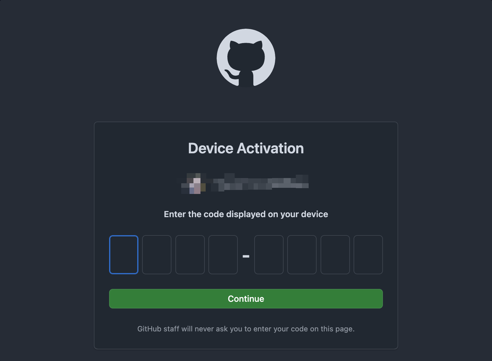
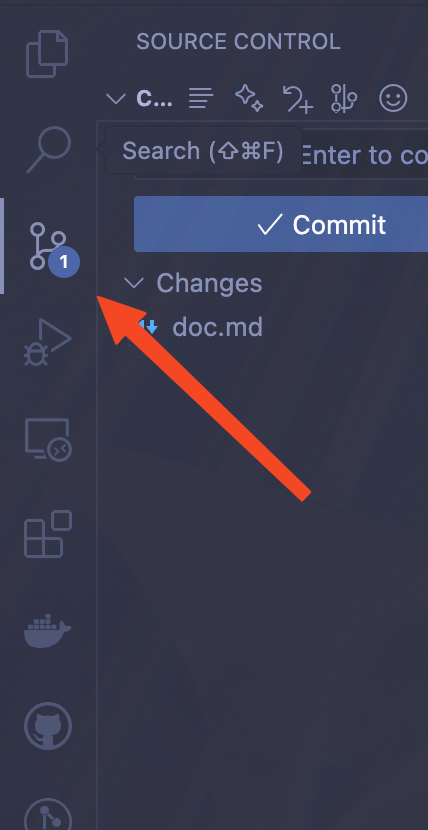
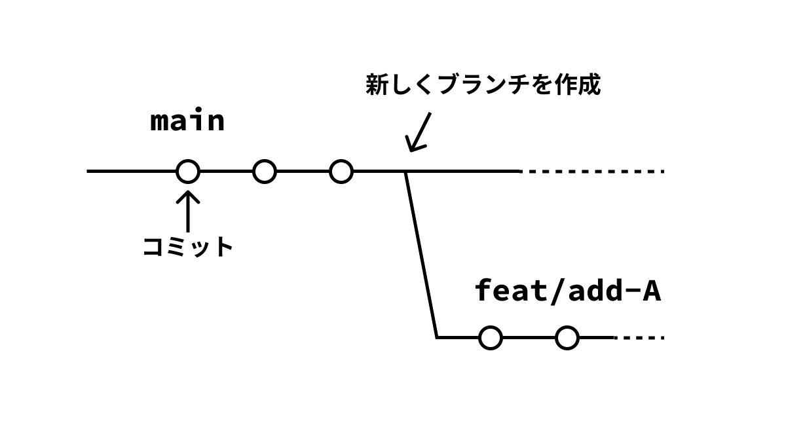
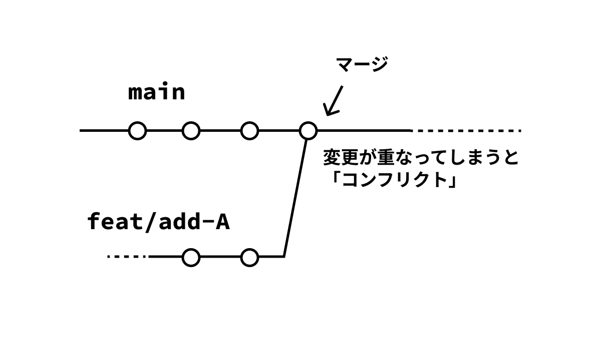
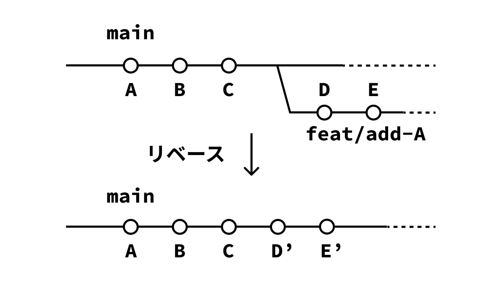

## 0. 環境構築

ここでは、team411 で Git/GitHub を使用していくために必要な環境構築をしていきます。
もうすでに、環境ができている人は軽く読み飛ばしてください。

### 0.1. GitHub アカウントの作成

[GitHub](https://github.com/)にアクセスし、「Sign Up」からアカウントを作成してください。
すでに GitHub アカウントを持っている人はそのアカウントを使用してください。

ここで登録時に使用したメールアドレスを覚えておいてください。
team411 の組織やリポジトリに招待されたときは、登録したメールアドレスに連絡が来ます。
普段よく使うメールアドレスが良いでしょう。

### 0.2. Git のインストール

まず、今回の研修で使用するメインのアプリケーションである、`git`をインストールします。
それぞれ自分が使っている OS の方法を参考にインストールしてください。

#### Windows の場合

`Win + R`キーを押下し、`powershell`と入力して`Enter`（Power Shell が開きます）。
以下のコマンドを入力し実行。

```powershell
winget install Git.Git
```

「このアプリがデバイスに変更を加えることを許可しますか？」と聞かれるので「はい」を選択。
実行が終わったらインストールは完了です。

#### MacOS の場合

「ターミナル」アプリを起動します。
まず、以下のコマンドを入力し実行して`brew`をインストールします。

```zsh
/bin/bash -c "$(curl -fsSL https://raw.githubusercontent.com/Homebrew/install/HEAD/install.sh)"
```

少し時間がかかると思いますが、待ちます。
実行が終わったら次に`brew`を使って`git`をインストールします。

以下のコマンドを入力し、実行してください。

```zsh
brew install git
```

実行が終わったらインストールは完了です。

#### Linux (Debian 系)の場合

ターミナルのアプリケーションを開き以下のコマンドを実行してください。

```zsh
sudo apt update
sudo apt install git
```

実行が終わったらインストールは完了です。

### 0.3. GitHub Cli のインストール

次に、先ほど作成した GitHub アカウントとの連携を簡単に行うためのアプリケーション`GitHub CLI`をインストールします。
これも同様に、それぞれ自分が使っている OS の方法を参考にインストールしてください。

#### Windows の場合

`Win + R`キーを押下し、`powershell`と入力して`Enter`（Power Shell が開きます）。
以下のコマンドを入力し実行。

```powershell
winget install GitHub.cli
```

「このアプリがデバイスに変更を加えることを許可しますか？」と聞かれるので「はい」を選択。
実行が終わったらインストールは完了です。

#### MacOS の場合

「ターミナル」アプリを起動します。
以下のコマンドを入力し、実行してください。

```zsh
brew install gh
```

実行が終わったらインストールは完了です。

#### Linux (Debian 系)の場合

ターミナルのアプリケーションを開き以下のコマンドを実行してください。

```zsh
sudo apt update
sudo apt install gh
```

実行が終わったらインストールは完了です。

### 0.4. ローカルの Git を自分の GitHub アカウントと連携

ターミナルアプリケーションを開き、以下のコマンドを実行して、先ほど作成した GitHub アカウントとの連携を行います。

```zsh
gh auth login
```

すると次のように表示されるので、そのまま`Enter`を押します。
（ログインに使うアカウントの種類を聞かれています。今回は GitHub を使用するのでそのままそれを選択します）

```zsh
? Where do you use GitHub?  [Use arrows to move, type to filter]
> GitHub.com
  Other
```

次に、認証の方法を聞かれるので、下矢印キーを押して「ssh」を選択し`Enter`を押します。

```zsh
? What is your preferred protocol for Git operations on this host?  [Use arrows to move, type to filter]
  HTTPS
> SSH
```

続けて、いくつか質問をされますので、そのまま`Enter`を押します。

```zsh
? Generate a new SSH key to add to your GitHub account? (Y/n)
? Enter a passphrase for your new SSH key (Optional):                            ? Title for your SSH key: (GitHub CLI)
```

次のように聞かれたら、「Login with a web browser」を選択し、`Enter`を押します。

```zsh
? How would you like to authenticate GitHub CLI?  [Use arrows to move, type to filter]
> Login with a web browser
  Paste an authentication token
```

`Press Enter to open https://github.com/login/device in your browser...`と言われますので、`Enter`を押して GitHub にログインする画面を開きます。

自分の GitHub アカウントで「Continue」します。


すると、次のような画面で、ワンタイムコードの入力を求められますので、先ほどコマンドを実行したターミナルに表示されているワンタイムコードを入力し、「Continue」します。



ワンタイムコード


これで、GitHub アカウントとの連携作業は完了です。

### 0.5. VSCode で Git を使う

Git は CLI（Command Line Interface、雑に言うと黒い画面）で使うものですが、VSCode の機能を使用することで快適に使用することができます。
ここでは、VSCode でのセットアップ方法を紹介します。CLI で使いたい人、VSCode ではないエディタを使用している人は、各自が使いやすい環境を作ってください。

#### 拡張機能をインストール

これらの拡張機能は入れなくても Git を使うことができますが、より便利になるので入れることを推奨します。

- GitLens
- Git Graph
- GitHub Pull Requests

#### VSCode から Git を使用する

あとで詳しく説明しますが、以下のアイコンのタブから Git の機能を使用します。



#### 0.6. (推奨) GitHub Copilot を使用するため学生プランの申請

ここでは、GitHub Copilot を学生プランで無料で使用するための、GitHub Student への申請方法を解説します。
この章の内容は必須ではありませんが、GitHub Copilot を使うことで劇的に作業効率を上げられるので使ってみることをおすすめします。
また、審査期間が 1 週間ほどあり、申請したらすぐに使えるようになるわけではないので早めにやることをおすすめします。

## 1. Git

### 1.0. Git とは

ここまで、Git という言葉を一切説明せずに使ってきましたが、そもそも Git とは何でしょうか。

簡単に説明すると、

> Git は、「**いつ、誰が、どのファイルをどう変更したか**」を記録し、
> 必要に応じて**過去の状態に戻せる**、**他人との作業の違いを見つけて統合できる**ようにするツール。

詳しくは、Git の公式ドキュメントに書いてありますので、そちらを読んでみてください。

[Git - What is Git?](https://git-scm.com/book/en/v2/Getting-Started-What-is-Git%3F)

それでは、Git がどのようなものなのかを、「概念」と「使い方」に分けてみていきましょう。

### 1.1. Git の基本概念

Git がどのような概念で構成されているのかを紹介します。
ここで完璧に理解する必要はありません。次の章以降で実際に操作していく中で、単語の意味がわからなかったら戻ってくる「用語辞典」のように使ってください。

#### リポジトリ（Repository）

Git で管理されている「プロジェクト全体の箱」のようなものです。
ファイルの中身はもちろん、いつ・誰が・何を変更したかという履歴も全てここに記録されています。

また、リポジトリには 2 つの種類があります。
一つ目は「ローカルリポジトリ」といい、自分の PC 上にあるリポジトリのことです。
二つ目は「リモートリポジトリ」で、後述する GitHub などに置かれているリポジトリです。
ローカリリポジトリで開発をし、リモートリポジトリに変更を同期して共同開発を進めていくのが一般的です。

#### コミット（Commit）

ファイルの変更内容を記録して、スナップショットとして保存する操作です。
（スナップショットとは今そのままのデータを丸ごと保存したもの）

「この時点ではこうだった」と履歴を残しておくことで、後から過去に戻ったり、変更を追うことが簡単にできるようになります。
コミットには、「コメント（コミットメッセージ）」をつけることで何をしたのかをわかりやすくすることが重要です。

コミットメッセージをわかりやすく書くためのルールも用意されてます。特に Angular の規約が有名です。興味がある人は参考にしてください。

[Angular - Git Commit Guidelines](https://github.com/angular/angular.js/blob/master/DEVELOPERS.md#-git-commit-guidelines)

#### ステージングエリア（Staging Area）

作業したファイルを「次のコミットに含める」ために一時的においておく場所です。
作業中に色々なファイルを変更しても、ステージングエリアに入れたものだけがコミットされる。

#### ブランチ（Branch）

「今の状態から分岐して別の作業をする」ための機能です。
例えば「新機能 A」を新しく開発するときに、`feat/add-A`という名前のブランチを作成し、元のコードに影響を与えずに開発できます。

作業が完了したら、元のブランチ（例: `main`）に統合します。
開発をする上では主となるブランチ（`main`、`master`など）を用意して、そこからブランチを切り作業を進めていくのが一般的です。



#### HEAD

現在自分が作業している場所を指すポインタで、通常は、「今いるブランチの最新のコミット」を指しています。
`HEAD`を動かすことで、過去のコミットに移動したり、別のブランチに切り替えたりできます。

#### マージ（Merge）

あるブランチ A で行った変更を、別のブランチ B に取り込む操作です。
例えば、`feat/add-A`での開発が終わったら、`main`にマージすることで新機能を反映させることができます。
内容が重ならなければそのままマージすることができる一方、重なってしまうとあとで説明する「コンフリクト（衝突）」が起きます。



#### リベース（Rebase）

変更履歴を「別のブランチの上に載せ直す」操作です。
ぱっと見はマージに似ていますが、履歴をより直線的で綺麗に保つために使われることが多いです。
最初のうちはあまり使うことはないはずなので、そこまで気にすることはないです。



#### コンフリクト（Conflict）

同じファイルの同じぎょうを、複数のブランチで別々に編集した場合に起こる「衝突」のことです。
Git がどちらの変更を採用するべきか判断できないときに発生し、「手動で解決」する必要があります。

エディタ上にどこがコンフリクトしているのかが示されるので、それをみて修正します。CLI 上で Git を操作する場合は Vim などのエディタが使われますが、VSCode を用いると GUI でコンフリクトを解消することができます。

### 1.2. 基本コマンド

ここでは、`git`で使用する基本的なコマンドについて、

- 役割
- 使い方
- VSCode の拡張機能との対応

について解説していきます。
後で演習で手を動かしながら使っていくので、流し読みしてもらって大丈夫です。
わからないことがあれば、戻ってくる、という感じで。重要なものには「●」がついています。これだけは読むようにしてください。

#### `git clone` ●

リモートリポジトリをローカルに複製することができます。

```zsh
git clone クローンしたいリポジトリ
```

のように使います。

#### `git add` ●

変更をステージングエリアに追加し、コミットの対象にします。

VSCode では、「+」のボタンを押すことで追加できます。


「変更」と書いてある場所をホバーすると、すべてを add することができます。


CLI で使用するには、

```zsh
git add 対象とするファイル
```

のように使います。作業したすべてのファイルをステージするには

```zsh
git add .
```

のようにします。`.`は現在のディレクトリを指すので、すべてのファイルが追加される、という仕組みです。

#### `git commit` ●

その名の通り、コミットを作成することができます。これによりステージされた変更が記録されます。

VSCode では、入力欄にコミットメッセージを入力し、コミットボタンを押すことでコミットができます。


CLI では以下のように使用します。

```zsh
git commit -m "コミットメッセージ"
```

#### `git push` ●

ローカルリポジトリの変更をリモートリポジトリに反映するコマンドです。
VSCode では、コミットした後に「変更の同期」ボタンを押すことで push できます。


CLI で使うのは少し難しいですが、次のように使います。

```zsh
git push リモートリポジトリ名 ブランチ名
```

リモートリポジトリ名は`origin`であることが多いです。
具体的には

```zsh
git push origin main
```

のように使います（`main`ブランチにコミットする例）。

#### `git switch` ●

ブランチの作成、切り替えを行うことができます。

VSCode では左下のブランチ名をクリックすることで、ブランチの一覧を表示し切り替えることができます。新しくブランチを作ることもできます。


CLI では、

```zsh
# ブランチの作成
git switch -c ブランチ名

# ブランチの切り替え
git switch ブランチ名
```

のように使用します。

#### `git pull` ●

リモートリポジトリから変更を取得し、その内容をローカルブランチにマージします。
マージされる対象は現在作業中のブランチです。

VSCode では「グラフ」の「プル」のアイコンから行うこともできますが、


左下のアイコンから「push」「pull」「fetch」などをすべてまとめて行うことが多いです。


CLI では

```zsh
git pull
```

と使用します。

#### `git fetch`

リモートリポジトリの最新の情報を取得します。
ローカルリポジトリにマージはされません。

VSCode で使用するときは、先ほど説明したボタンを使うことが多いです。

CLI では

```zsh
git fetch
```

とすることで、リモートのすべての変更を取得することができます。

#### `git merge`

別のブランチの内容を現在のブランチにマージするコマンドです。

VSCode では Git Graph から、マージ元のブランチを右クリックし「Merge into current branch」をクリックすることでマージすることができます。


CLI では、ブランチ A にいる状態で

```zsh
git merge B
```

のようにすると、ブランチ B の内容が現在作業しているブランチ A にマージされます。

#### `git stash`

ステージしていない作業中の変更を一時退避する機能です。

VSCode では Git Graph でコミットしていない変更（Uncommitted Changes）を右クリックし、「Stash uncommitted changes」をクリックすることでスタッシュができます。


CLI では、

```zsh
git stash
```

でスタッシュすることができます。スタッシュに説明文を追加するには、

```zsh
git stash save "作業内容の説明"
```

のようにします。スタッシュした変更の一覧は

```zsh
git stash list
```

で見ることができ、`stash@{0}`、`stash@{1}`のような形式で表示されます。
スタッシュした内容を現在の作業に反映させる方法は 2 種類あります。
まず、スタッシュした内容を復元して削除する`pop`という方法で、

```zsh
# 最新のstashを適用して削除
git stash pop

# N番目のstashを適用して削除
git stash pop stash@{N}
```

のように使用します。もう一つの`apply`は、`pop`に似ていますが、こちらは変更を復元した後削除をしないという方法です。

```zsh
# 最新のstashを適用
git stash apply

# N番目のstashを適用
git stash apply stash@{N}
```

のように使用します。また、スタッシュした内容がいらなくなった時は削除することができます。

```zsh
# N番目のstashを削除
git stash drop stash@{N}

# すべてのstashを削除
git stash clear
```

のように使うことで、コミットメッセージをつけ、コミットすることができます。

#### `git reset`

コミットやステージの状態を過去の状態に戻すことができます。
以下のようなオプションがあります。

- `--hard`: add、commit、作業内容をすべて削除します
- `--mixed`: add と commit を取り消します
- `--soft`: commit のみ取り消します

VSCode では Git Graph でそこまで戻したいコミットを右クリックし、「Reset current branch to this Commit」をクリックして、オプションを選択することでリセットできます。


CLI でも同様に、どのコミットまで戻したいかを指定でき、`^`や`~`をつけることで直前のコミットを表すことができます（例: `HEAD^`）。

#### `git revert`

指定したコミットを「打ち消す」新しいコミットを作成します。

VSCode では Git Graph でリバートしたいコミットを右クリックし、「Revert」をクリックすることで行えます。

CLI では、

```zsh
git revert コミットID
```

のように使います。

### 1.3 練習

#### リポジトリの作成

まず GitHub からリポジトリを作成してください。

[Create a new repository](https://github.com/new)


リポジトリの名前は「git-workshop-2025」がいいでしょう。
リポジトリの公開設定は「Public」にするようにしてください。


「Create repository」をクリックすると、リポジトリが作成されます。
次に、リポジトリの URI をコピーします。クリップボードへコピーするボタンをクリックします。


コピーした URI を使ってリポジトリをクローンします。

```zsh
git clone コピーしたURI
```

#### ファイルの編集からプッシュまで

次に、このリポジトリを使ってファイルの編集からプッシュまでを行なっていきます。
`README.md`というファイルを新しく作成し、内容を適当に追加してください。
（追加する内容はなんでも構いません。ただ、公開リポジトリになっていますので、公開したく内容は載せないようにしてください。）

ファイルの作成・内容の追加ができたら、1.2 を参考にしながら、コミットとプッシュを行なってください。

### 1.4. その他知っておくと便利なこと

さて、Git の基本的な使い方は前章まででわかったかと思います。
ここでは、Git についてもう少し踏み込んだ内容を解説します。

前章まででいっぱいな人は飛ばして構いません。

#### `.gitignore`

`.gitignore`ファイルは、Git に対して追跡させたくないファイルやディレクトリを指定する設定ファイルです。

ビルド成果物・個人設定ファイル・環境変数ファイルなどを無視する際に使用します。

`.gitignore`ファイルの例

```gitignore
node_modules/
dist/
.env
```

#### `.gitignore`を変更したのに適用されない時

一度 Git が追跡したファイルは、`.gitignore`に追加しても無視されません。
そのため、`.gitignore`を変更したのに適用されない、といったことが起こります。
その時は、キャッシュを削除し、再度コミットすることで`.gitignore`を適用することができます。

キャッシュの削除方法は以下の通りです。

```zsh
# 特定のファイルのキャッシュを削除したい
git rm --cached ファイル名

# すべてのファイルのキャッシュを削除したい
git rm --cached .
```

#### `.gitkeep`

Git は空のディレクトリを追跡できません。そのため、意図的に空のディレクトリをコミットしたい場合、空の`.gitkeep`ファイルを置いておくことで実現できます（ただしこれは Git の公式仕様ではなく、慣習となっています）。

#### commitlint を使ったコミットメッセージのチェック

`commitlint`は、コミットメッセージのフォーマットを自動でチェックするツールです。

[Commitlint](https://commitlint.js.org/)

このツールを次で紹介する pre-commit などと組み合わせて使うことで、コミット時にコミットメッセージをチェックすることが可能になります。

#### pre-commit について

`pre-commit`を使うことで、Git のフック（hook）の一つで、`git commit`を実行する前に、任意のスクリプトが実行できます。

先ほど紹介した`commitlint`の他に、コードのフォーマッタや Linter などと組み合わせて使用します。

`pre-commit`を設定するには、`husky`や`lefthook`などのツールを使います。

- [husky](https://github.com/typicode/husky)
- [lefthook](https://github.com/evilmartians/lefthook)

#### GPG を用いたコミットの認証

GPG(GNU Privact Guard)を使うと、コミットに署名する子ができ、そのコミットが本人によるものだと証明できます。

様々な設定方法がありますので、気になる人は公式ドキュメントを覗いてみてください。

[Managing commit signature verification - GitHub](https://docs.github.com/en/authentication/managing-commit-signature-verification)

## 2. GitHub

### 2.0. GitHub とは？

GitHub とは、何でしょうか？

簡単に説明すると、

> Git で管理されたコードをインターネット上に置き、協力して開発できる Web サービス

です。似たようなものに GitLab などもあります。
こちらについても気になる人は、GitHub の公式ドキュメントを覗いてみてください。

[About Github and Git - About GitHub](https://docs.github.com/en/get-started/start-your-journey/about-github-and-git#about-github)

### 2.1. GitHub を使った開発の流れ

ここでは、実際に team411 で行われている開発の流れを、実際に手を動かしながら学んでいきます。

#### リポジトリをクローン（もしくは新しく作成）する

`git@github.com:team411-uec/git-workshop-2025-practice.git` のリポジトリをクローンしてください。

#### Issue を立てる

次に、[Issues](https://github.com/team411-uec/git-workshop-2025-practice/issues?q=sort:updated-desc+is:issue+is:open) から、Issue を発行してください。

Issue の名前は「自分の GitHub のアカウント名」にしてください。


#### ブランチを切る

ローカルでブランチを新しく作成してください。
名前は「`feat/<Issue番号>-<アカウント名>`」にしてください。
（例）Issue 番号が 1、アカウント名が「mimifuwa」の場合「`feat/1-mimifuwa`」となります。

#### コミット・プッシュする

「`自分のアカウント名.md`」というファイルを新しく作成し、中身を適当に編集し、1.3.練習でやったようにコミット・プッシュをしてください。

#### Pull Request(PR)を作成する

プッシュしたら、GitHub の [Pull Requests](https://github.com/team411-uec/git-workshop-2025-practice/pulls?q=sort:updated-desc+is:pr+is:open) から、新たに Pull Request(PR)を作成してください。
PR のタイトルは「自分のアカウント名」にしてください。


終わったら、以下のフォームに自分のアカウント名を記入してください。

[https://forms.gle/UqmbHkkKpGfq8w429](https://forms.gle/UqmbHkkKpGfq8w429)

また、右側にある「Development」から、先ほど発行した Issue を紐づけます。


#### レビュー

フォームに回答したら講師がレビューをします。
しばしお待ちを...

#### マージ


「Approve」されたら、「Merge pull request」を押し、マージしてください。

#### Issue・PR のクローズ

マージすると Pull request と Issue が自動的にクローズされます。
